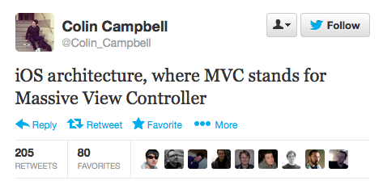

## [fit] Practical 
## [fit] MVVM

^I am going to talk about approaching MVVM in a practical way.

---


@ksmandersen

---

## [fit] Practical 
## [fit] MVVM

---

The Model View ViewModel (MVVM) is an architectural pattern used in software engineering that originated from Microsoft as a specialization of the Presentation Model design pattern introduced by Martin Fowler

---

The Model View ViewModel (MVVM) is an architectural pattern used in software engineering that originated from _Microsoft_ as a specialization of the Presentation Model design pattern introduced by Martin Fowler

---


---


---


Largely based on the model–view–controller pattern (MVC), MVVM is a specific implementation targeted at UI development platforms which support event-driven programming, specifically Windows Presentation Foundation (WPF) and Silverlight on the .NET platforms using XAML and .NET languages. Technically different, but similar, Presentation Model design patterns are available in HTML5 through AngularJS, KnockoutJS, Ext JS, Vue.js, and for Java the ZK framework (Model-View-Binder).

---

Largely based on the model–view–controller pattern (MVC), MVVM is a specific implementation targeted at UI development platforms which support event-driven programming, specifically Windows Presentation Foundation (_WPF_) and _Silverlight_ on the _.NET_ platforms using _XAML_ and .NET languages. Technically different, but similar, Presentation Model design patterns are available in HTML5 through _AngularJS_, _KnockoutJS_, Ext JS, Vue.js, and for _Java_ the ZK framework (Model-View-Binder).

---

# [fit] MVVM
## Without ReactiveCocoa

^I originally named this talki MVVM without ReactiveCocoa. I did that because every time I would see someone mentioning MVVM in relation to iOS they were mixing ReactiveCocoa into it. Now.. I am not a big fan of ReactiveCocoa. Hence the naming. But as I started researching MVVM it became apparent to me why ReactiveCocoa is a big part of it.

---

# [fit] MVVM
## Without ~~ReactiveCocoa~~

^I originally named this talki MVVM without ReactiveCocoa. I did that because every time I would see someone mentioning MVVM in relation to iOS they were mixing ReactiveCocoa into it. Now.. I am not a big fan of ReactiveCocoa. Hence the naming. But as I started researching MVVM it became apparent to me why ReactiveCocoa is a big part of it.

---

# MVC

---



---


---
# [fit] Massive 
# [fit] ViewController

---
# [fit] Mistreated
# [fit] ViewControllerr

---


---


---


---

```swift
class Show: RLMObject {
	dynamic var identifier: Int
	dynamic var name: String
	dynamic var posterPath: String
	dyanmic var firstAired: NSDate
}
```

^ Using examples from Televised. The is the Data Model. It is backed by Realm

---

```swift
class ShowListViewController: UIViewController, UICollectionViewDataSource {
	func numberOfSectionsInCollectionView(collectionView: UICollectionView) -> Int {
		return Int(fetchedResultsController.sections.count)
	}
	    
	func collectionView(collectionView: UICollectionView, numberOfItemsInSection section: Int) -> Int {
		if let info = fetchedResultsController.sections[section] {
			return info.numberOfObjects
		}	

		return 0
	}
	    
	func collectionView(collectionView: UICollectionView, cellForItemAtIndexPath indexPath: NSIndexPath) -> UICollectionViewCell {
		let cell = collectionView.dequeueReusableCellWithReuseIdentifier(reuseIdentifier, forIndexPath: indexPath) as ShowCell
		if let show = fetchedResultsController.objectAtIndexPath(indexPath) {
	        cell.titleLabel.text = cell.name
			if let posterURL = NSURL(string: show.posterPath) { 
				cell.posterImageView.hnk_setImageFromURL(posterURL)
			}

			if let firstAired = someFormatter.dateFromString(show.firstAired) {
				cell.firstAiredLabel.text = firstAired
			}
		}

		return cell
	}
}
```

^A standard ViewController for a DataSource. It is backed by a FetchedResultsController. And it populates the TableView Cells right in the cellForItemAtIndexPath

---

```swift
class ShowListViewController: UIViewController, UICollectionViewDataSource {
	func numberOfSectionsInCollectionView(collectionView: UICollectionView) -> Int {
		return Int(fetchedResultsController.sections.count)
	}
	    
	func collectionView(collectionView: UICollectionView, numberOfItemsInSection section: Int) -> Int {
		if let info = fetchedResultsController.sections[section] {
			return info.numberOfObjects
		}	

		return 0
	}
	    
	func collectionView(collectionView: UICollectionView, cellForItemAtIndexPath indexPath: NSIndexPath) -> UICollectionViewCell {
		let cell = collectionView.dequeueReusableCellWithReuseIdentifier(reuseIdentifier, forIndexPath: indexPath) as ShowCell
		if let show = fetchedResultsController.objectAtIndexPath(indexPath) {
			cell.configureWithShow(show)
		}
	        
	    return cell
	}
}
```

^Let's pull that code in to a seperate view method. ViewControllers shouldn't know how to populate views.

---
```swift
class ShowListCell: UITableViewCell {
	func configureWithShow(show: Show) {
		titleLabel.text = cell.name
		if let posterURL = NSURL(string: show.posterPath) { 
			posterImageView.hnk_setImageFromURL(posterURL)
		}

		if let firstAired = someFormatter.dateFromString(show.firstAired) {
			firstAiredLabel.text = firstAired
		}
	}
}
```
^Here we have the view and its configuring method. But look at all the formatting and converting we do here. It doesn't feel right. Views shouldn't know about this stuff. It's not reusable. Let's try to fix that

---

```swift
class ShowViewModel {
	var identifier: String { get }
	var name: String { get }
	var posterURL: NSURL? { get }
	var firstAiredFormatted: String { get }

	init(show: Show)
}
```

^Let's define a View Model. ViewModels are plain objects instantiated with their models. We expose the methods we need in the format they're displayed

---
```swift
class ShowListCell: UITableViewCell {
	func configureWithViewModel(viewModel: ShowViewModel) {
		titleLabel.text = viewModel.name

		if let posterURL = viewModel.posterURL { 
			posterImageView.hnk_setImageFromURL(posterURL)
		}

		firstAiredLabel.text = viewModel.firstAiredFormatted
	}
}

```
^Let's change the view to use the View Model. This looks much better. This can very easily be reused. Let's go back and look at that ViewController

---
```swift
class ShowListViewController: UIViewController, UICollectionViewDataSource {
	func numberOfSectionsInCollectionView(collectionView: UICollectionView) -> Int {
		return Int(fetchedResultsController.sections.count)
	}
	    
	func collectionView(collectionView: UICollectionView, numberOfItemsInSection section: Int) -> Int {
		if let info = fetchedResultsController.sections[section] {
			return info.numberOfObjects
		}	

		return 0
	}
	    
	func collectionView(collectionView: UICollectionView, cellForItemAtIndexPath indexPath: NSIndexPath) -> UICollectionViewCell {
		let cell = collectionView.dequeueReusableCellWithReuseIdentifier(reuseIdentifier, forIndexPath: indexPath) as ShowCell
		
		if let show = fetchedResultsController.objectAtIndexPath(indexPath) {
			let viewModel = ShowViewModel(show)
			cell.configureWithViewModel(viewModel)
		}
	        
	    return cell
	}
}
```

^Now we need to use the View Models in our view controller instead. We have a awful tight couple between the data format/layer and our controller. We could pull this out in a seperate Data Source object. But the View Controller is pretty small and there is something better we can do

---

```swift
class ShowListViewModel {
	var numberOfSections: Int { get }

	func numberOfShowsInSection(section: Int) -> Int
	func viewModelAtIndexPath(indexPath: NSIndexPath) -> ShowViewModel
}
```

^We can define a ViewModel that describes the list of Shows. And let that ViewModel holder the other ones.

--- 

```swift
class ShowListViewController: UIViewController, UICollectionViewDataSource {
	func numberOfSectionsInCollectionView(collectionView: UICollectionView) -> Int {
		return viewModel.numberOfSections
	}
	    
	func collectionView(collectionView: UICollectionView, numberOfItemsInSection section: Int) -> Int {
		return viewModel.numberOfRowsInSection(section)
	}
	    
	func collectionView(collectionView: UICollectionView, cellForItemAtIndexPath indexPath: NSIndexPath) -> UICollectionViewCell {
		let cell = collectionView.dequeueReusableCellWithReuseIdentifier(reuseIdentifier, forIndexPath: indexPath) as ShowCell
		
		if let show = viewModel.viewModelAtIndexPath(indexPath)
			cell.configureWithViewModel(show)
		}
	        
	    return cell
	}
}
```

^Now we've completely seprated the concerns of the ViewController, the Model and the View by inserting a ViewModel. We could even pull these dataSource methods out into an plain data source object if we wanted.

---

```swift
class ShowViewModel {
	var identifier: String { get }
	var name: Observable<String> { get }
	var posterURL: Observable<NSURL?> { get }
	var firstAiredFormatted: Observable<String> { get }

	init(show: Show)
}
```

^Now. About RAC

---

```swift
class ShowListCell: UITableViewCell {
	func configureWithViewModel(viewModel: ShowViewModel) {
		viewModel.overview.afterChange += { [unowned self] in titleLabel.text = $1 }
        viewModel.posterImageURL.afterChange += { [unowned self] in self.posterImageView.hnk_setImageFromURL($1) }
        viewModel.firstAiredFormatted.afterChange += { [unowned self] in self.firstAiredLabel.text = $1 }
	}
}

```

---


@ksmandersen