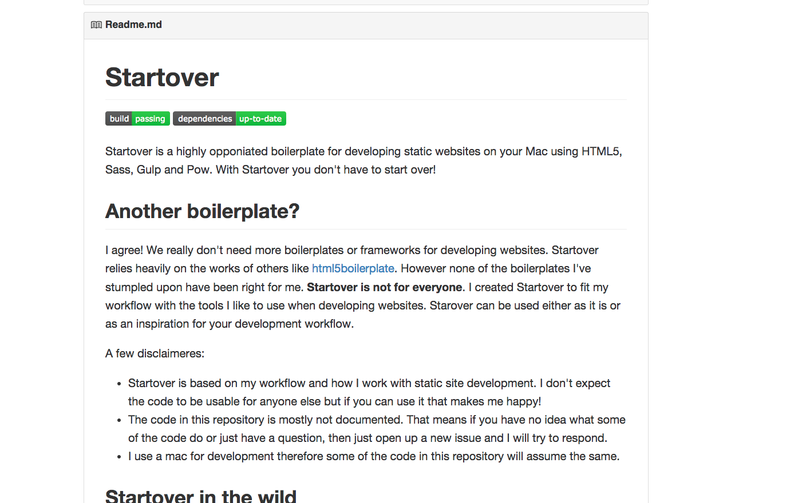

## [fit] Welcome to
## [fit] Copenhagen Frontenders

^
Introduce myself
Thanks for coming (# members)
What a turnout
Venue & Program

---


^
Introduce Robocat & what we do
Spilhuset

---

## [fit] Static Web Sites
## [fit] With Gulp & AWS

^
Introduce the talk

---


^
We work on a lot of apps
and all these apps need websites.
Static web sites are a natural fit

---


^
We used to used two awesome tools
What is Hammer?
What is Forge?

---


^
Introduce the features of hammer and how it works

---

# Demo

---

## What are the problems?

- No toolchain control
- Limited by Liquid
- Updates are infrequent
- Compiler is integrated

---


---


---

# I can make that

---

## Automate Workflows

- Compile Sass / Coffeescript
- Minify Javascript / CSS
- Compress image files


^
Gulp is a command line tool that automates workflows.
Define tasks that can be executed

---

## Installing Gulp

```bash
$ npm install --save-dev gulp
```

``gulpfile.js``

```javascript
var gulp = require('gulp');

gulp.task('hello-world', function() {
	console.log("Hello World");
})
```

```bash
$ gulp
Hello World
```

---

## Installing Gulp

```bash
$ npm install --save-dev gulp coffee-script
```

``gulpfile.coffescript``

```coffeescript
gulp = require 'gulp'

gulp.task 'hello-world', ->
	console.log "Hello World"
```

```bash
$ gulp
Hello World
```

---

## Compile Sass

```coffeescript
gulp = require 'gulp'
sass = require 'gulp-sass'

gulp.task 'compile-sass', ->
	gulp.src("./sass")
		.pipe(sass())
		.pipe(gulp.dest('./css'))
```

---

## Compile Sass with Sourcemaps

```coffeescript
gulp = require 'gulp'
sass = require 'gulp-sass'
sourcemaps = require 'gulp-sourcemaps'

gulp.task 'compile-sass', ->
	gulp.src("./sass")
		.pipe(sass())
		.pipe(sourcemaps.init())
		.pipe(sourcemaps.write('./maps'))
		.pipe(gulp.dest('./css'))
```

---

## Watching for changes

```coffeescript

gulp.task 'watch', ->
	gulp.watch './css', ['compile-sass']
```

---

## Watching for changes & Reloading

```coffeescript
reload = require 'gulp-livereload'

gulp.task 'watch', ->
	reload.listen '9091'

	gulp.watch './css', ['compile-sass']
```

``index.html``

```html
<script src="//localhost:9091/livereload.js"></script>
```

---

# Demo

---


---

## Deploying to S3

```bash
$ gem install s3_website
```

---

## Deploying to S3

``s3_website.yml``

```ruby
site_name: example.com
s3_id: <%= ENV['S3_ACCESS_KEY_ID'] %>
s3_secret: <%= ENV['S3_SECRET_ACCESS_KEY'] %>
s3_bucket: site_name

site: build
max_age:
    "*": 300
gzip: true

cloudfront_distribution_config:
    aliases:
        quantity: 1
        items:
            CNAME: site_name
```

---

## Deploying to S3

``.env``

```ruby
S3_ACCESS_KEY_ID=YADAYADAYADA
S3_SECRET_ACCESS_KEY=TROLOLOLOLO
```

Watch the magic happen

```bash
$ gulp && s3_website push
```

---



# Startover

---

# Demo

---


---


## robo.cat/jobs